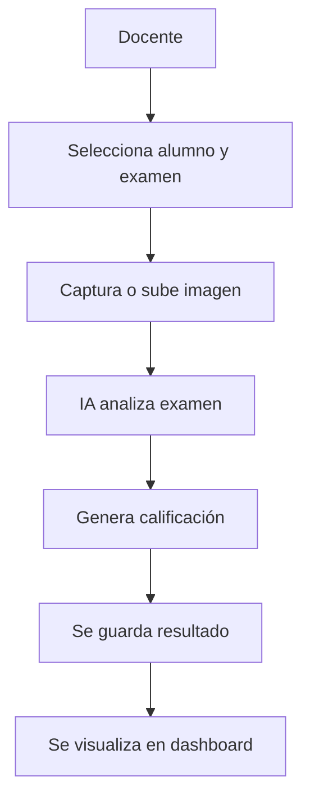

# 🎓 EduScan

### 🚀 Plataforma Inteligente de Corrección de Exámenes con IA

---

## 🟦 Descripción

**EduScan** es una plataforma web diseñada para docentes que permite **corregir exámenes automáticamente mediante Inteligencia Artificial**, utilizando imágenes capturadas desde la cámara o cargadas desde el dispositivo.

---

## 📁 Estructura del Proyecto


```bash
EDUSCAN/
│
├── .github/                # Configuración de CI/CD (GitHub Actions)
├── backend/               # API Gateway y lógica principal (FastAPI)
├── eduscan-ia/            # Servicio de Inteligencia Artificial
├── frontend/              # Interfaz de usuario (Dashboard)
├── kubernetes/            # Configuración de despliegue en Kubernetes
├── docs/                  # Documentación del proyecto
├── tests/                 # Pruebas del sistema
│
├── app.js                 # Servidor Node.js (si aplica)
├── db.js                  # Conexión a base de datos
├── main.py                # Entrada principal del backend
│
├── docker-compose.yml     # Orquestación de contenedores
├── init_db.sql            # Script de inicialización de base de datos
├── backup.sql             # Backup de la base de datos
│
├── package.json           # Dependencias Node.js
├── .env                   # Variables de entorno
├── .gitignore             # Archivos ignorados por Git
│
└── README.md              # Documentación principal
```

---

## 🧠 Funcionalidades Principales

### 🎥 Dashboard Corrector

> 📌 Evaluación automática de exámenes

* 📸 Captura desde cámara
* 🖼️ Subida de imágenes
* 🤖 Análisis con IA
* 📊 Generación automática de calificación
* ✅ Detección de respuestas correctas e incorrectas

---

### ☁️ Dashboard Nube

> 📌 Gestión académica

| Módulo           | Función                        |
| ---------------- | ------------------------------ |
| 👨‍🎓 Alumnos    | Registro y visualización       |
| 📝 Exámenes      | Administración de evaluaciones |
| 📚 Módulos       | Organización académica         |
| ⭐ Calificaciones | Resultados de los estudiantes  |

---

## 🏗️ Arquitectura del Sistema

* 🔹 Arquitectura de microservicios
* 🔹 API Gateway con FastAPI
* 🔹 Servicios independientes:

  * 📊 Base de datos
  * 🤖 Inteligencia Artificial
  * ⚙️ Procesamiento

---

## ⚙️ Tecnologías Utilizadas

| Tecnología          | Uso                   |
| ------------------- | --------------------- |
| 🐍 Python (FastAPI) | Backend / API Gateway |
| 🌐 HTML, CSS, JS    | Frontend              |
| 🐳 Docker           | Contenedores          |
| ☁️ Render           | Despliegue en la nube |
| 🤖 Machine Learning | Análisis de exámenes  |
| 🧠 Deep Learning    | Evaluación automática |

---

## 🔄 DevOps & Automatización

* 🔁 CI/CD con GitHub Actions
* 📦 Contenerización con Docker
* 🚀 Deploy automático en la nube

---

## 📚 Documentación

Incluye:

* 📄 Documentación general
* 📌 Historias de usuario
* 🗺️ Diagramas
* 🧩 DER (Entidad-Relación)
* 🔗 Documentación de endpoints
* 📑 Documentación técnica

---

## 🧪 Pruebas

* ✔️ Pruebas funcionales
* ✔️ Validación de microservicios
* ✔️ Testing de endpoints

---

## ☁️ Despliegue

* 🌐 Plataforma desplegada en Render
* 🐳 Uso de Docker para contenedores

---

## 📁 Estructura del Proyecto


---

## 📸 Flujo del Sistema



---

## 🎯 Objetivo

Optimizar el proceso de evaluación académica mediante Inteligencia Artificial, reduciendo tiempo y aumentando precisión.

---

## 📌 Estado del Proyecto

🟢 Funcional
☁️ Desplegado en la nube
🔄 CI/CD activo

---


Proyecto desarrollado como solución tecnológica educativa usando IA, microservicios y despliegue en la nube.
